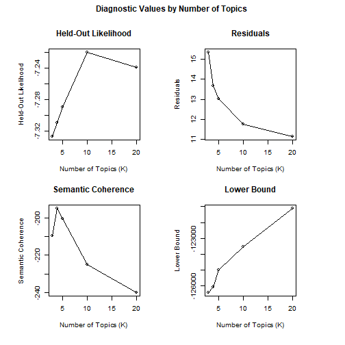
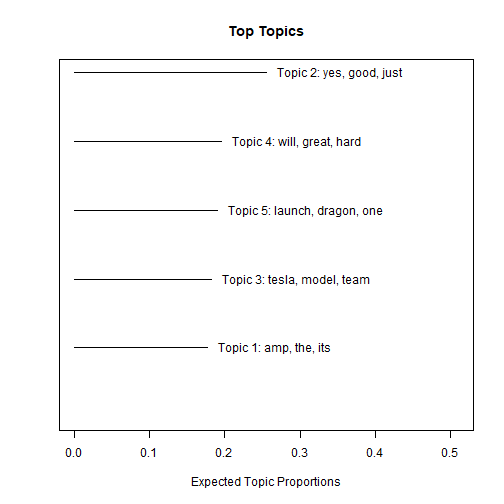

Introduction

Over the past couple of months, after years criticism, short selling, and just pure pessimism, Wall Street has finally bought into what Elon Musk and Tesla is doing and the potential it has to disrupt the energy industry. After reaching a pandemic-induced low of 360 a share in March, Tesla's stock has exploded to over 2000 since, as investors continue to tout its journey to finally reaching 4 straight quarters of profitability. The stocks' recent ride to stardom, however, has not been without its lulls. Specifically speaking, its price dropped a whopping 12% in a matter of just one day. The reason had literally nothing to do with updates on the fundamentals of the business. It was this:


```r

```


It's not the first time Elon's words on twitter have moved its stock, either. After jokingly announcing that he had funding secured to take Tesla private at 420 a share, Tesla's stock again moved significantly on his tweet. 

Similar to the Trump Twitter analysis, I wanted to see if the contents of Elon's twitter account had any correlation to Tesla's stock price. Let's find out:


Importing and cleaning twitter and tesla stock data


```r
tweet_data = read.csv("elonmusk_user_tweets.csv")
tweet_df = as.data.frame(tweet_data)

stock_data = read.csv("TSLA.csv")

tsla_data = as.data.frame(stock_data)
tsla_df = tsla_data %>%
  select (Date, Close, Perc_Change, Abs_Perc_Change)
tsla_df$Date = as.Date(tsla_df$Date, "%m/%d/%Y")
tsla_df$Close = as.numeric(tsla_df$Close)
tsla_df$Perc_Change = as.numeric(tsla_df$Perc_Change)
tsla_df$Abs_Perc_Change = as.numeric(tsla_df$Abs_Perc_Change)


tsla_df$market_moving = 0

for (q in 1:length(tsla_df$Abs_Perc_Change)) {
  if (tsla_df$Abs_Perc_Change[q] > .035) {
    tsla_df$market_moving[q] = 1
  }
}
```


Merging dataframes together


```r
tweet_df = tweet_df %>%
  select(Text, UTC)
tweet_df$UTC = substr(tweet_df$UTC,1,10)
tweet_df$UTC = as.Date(tweet_df$UTC, format = "%Y-%m-%d")
tweet_df$Text = as.character(tweet_df$Text)

final_table <- merge(x = tweet_df, y = tsla_df, by.x = "UTC", by.y = "Date", all.x = TRUE)

final_table = final_table %>%
fill(Close, Perc_Change, Abs_Perc_Change, market_moving, Perc_Change,.direction = "down")
```

Topic Modeling

```r
topic_dataframe_musk <- as.data.frame(cbind(final_table$market_moving, final_table$Text))  %>%
  mutate(market_moving = V1,
         text = V2,
         doc_id = 0) %>%
  select(text, market_moving, doc_id)

toggle = 1
for (i in 1:length(topic_dataframe_musk$doc_id)) {
  topic_dataframe_musk$doc_id[i] = toggle
  toggle = toggle + 1
  
}


cleanDataframe_musk = topic_dataframe_musk %>%
  mutate(text = as.character(text), 
         text = str_replace_all(text, "\n", " "),
         text = str_replace_all(text, "\\@\\w*", ""),
         text = str_replace_all(text, "(\\[.*?\\])", ""),
         text = str_squish(text), 
         text = gsub("([a-z])([A-Z])", "\\1 \\2", text), 
         text = removeWords(text, c("’", stopwords(kind = "en"))), 
         text = removePunctuation(text), 
         text = removeNumbers(text)) %>%
  as.data.frame()

set.seed(1001)

holdoutRows = sample(1:nrow(cleanDataframe_musk), 100, replace = FALSE)

tweetText_musk = textProcessor(documents = cleanDataframe_musk$text[-c(holdoutRows)],
                          metadata= cleanDataframe_musk[-c(holdoutRows), ],
                          stem = FALSE,
                          lowercase = FALSE)
```

```
## Building corpus... 
## Removing punctuation... 
## Removing stopwords... 
## Removing numbers... 
## Creating Output...
```

```r
tweetprep_musk <- prepDocuments(documents = tweetText_musk$documents,
                           vocab = tweetText_musk$vocab,
                           meta = tweetText_musk$meta)
```

```
## Removing 4044 of 6635 terms (4044 of 22273 tokens) due to frequency 
## Removing 98 Documents with No Words 
## Your corpus now has 2839 documents, 2591 terms and 18229 tokens.
```

```r
#kTest_musk <- searchK(documents = tweetprep_musk$documents,
                 #vocab = tweetprep_musk$vocab,
                 #K = c(3,4,5,10,20), verbose = FALSE)

load("kTest_musk.RData")
plot(kTest_musk)
```



```r
#save(kTest_musk, file = "R/kTest_musk.RData")

#topics10_musk = stm(documents = tweetprep_musk$documents,
               #vocab = tweetprep_musk$vocab, seed = 1001,
               #K = 5, verbose = FALSE)

load("topics10_musk.RData")

labelTopics(topics10_musk)
```

```
## Topic 1 Top Words:
##  	 Highest Prob: amp, the, its, high, people, many, like 
##  	 FREX: definitely, air, oxygen, put, light, invasive, latter 
##  	 Lift: alive, appears, ariel, bankrupt, bitcoin, breathing, buff 
##  	 Score: amp, its, high, the, people, definitely, air 
## Topic 2 Top Words:
##  	 Highest Prob: yes, good, just, much, true, sure, haha 
##  	 FREX: haha, false, twitter, course, wow, droneship, true 
##  	 Lift: boats, chloroquine, deployment, distinguish, happening, helpful, highly 
##  	 Score: yes, haha, true, sure, much, starship, good 
## Topic 3 Top Words:
##  	 Highest Prob: tesla, model, team, soon, solar, cybertruck, coming 
##  	 FREX: tesla, model, thanks, china, fsd, free, thank 
##  	 Lift: angle, anywhere, austin, award, basic, book, china 
##  	 Score: tesla, model, thanks, soon, solar, team, roof 
## Topic 4 Top Words:
##  	 Highest Prob: will, great, hard, yeah, probably, lot, need 
##  	 FREX: year, raptor, engine, thrust, months, volume, bit 
##  	 Lift: catch, countries, development, inches, meme, shot, stack 
##  	 Score: will, great, yeah, raptor, engine, hard, thrust 
## Topic 5 Top Words:
##  	 Highest Prob: launch, dragon, one, time, falcon, space, will 
##  	 FREX: dragon, crew, mission, astronauts, dragons, nice, spacecraft 
##  	 Lift: abort, agreed, aliens, ascent, attack, attempt, aug 
##  	 Score: dragon, crew, launch, falcon, mission, dragons, test
```

```r
plot(topics10_musk)
```



Now that I have the topics, I want to see if there is any correlation between topic 3 and Tesla's stock price


```r
TopicModel2_musk = as.data.frame(cbind(tweetprep_musk$meta$text, tweetprep_musk$meta$market_moving,tweetprep_musk$meta$doc_id, topics10_musk$theta))
TopicModel2_musk$V4 = as.numeric(as.character(TopicModel2_musk$V4))
TopicModel2_musk$V5 = as.numeric(as.character(TopicModel2_musk$V5))
TopicModel2_musk$V6 = as.numeric(as.character(TopicModel2_musk$V6))
TopicModel2_musk$V7 = as.numeric(as.character(TopicModel2_musk$V7))
TopicModel2_musk$V8 = as.numeric(as.character(TopicModel2_musk$V8))


TopicModel2_musk$V2 = as.numeric(as.character(TopicModel2_musk$V2)) - 1 
colnames(TopicModel2_musk) = c("text", "Market_Moving_Dummy", "ID", "Topic1", "Topic2", "Topic3", "Topic4", "Topic5")
```


Now, I want to run a logistic regression to see if there is a correlation between "Market moving" and the probability of being within topics


```r
log_table_musk = TopicModel2_musk %>%
  select(-"ID")

logit_mod_musk3 <-
  glm(Market_Moving_Dummy~ Topic3, family = binomial(link = 'logit'), data = log_table_musk)

summary(logit_mod_musk3)
```

```
## 
## Call:
## glm(formula = Market_Moving_Dummy ~ Topic3, family = binomial(link = "logit"), 
##     data = log_table_musk)
## 
## Deviance Residuals: 
##     Min       1Q   Median       3Q      Max  
## -1.0137  -1.0016  -0.9684   1.3624   1.4949  
## 
## Coefficients:
##             Estimate Std. Error z value Pr(>|z|)    
## (Intercept)  -0.3931     0.0543  -7.238 4.55e-13 ***
## Topic3       -0.3766     0.2140  -1.760   0.0784 .  
## ---
## Signif. codes:  0 '***' 0.001 '**' 0.01 '*' 0.05 '.' 0.1 ' ' 1
## 
## (Dispersion parameter for binomial family taken to be 1)
## 
##     Null deviance: 3788.8  on 2838  degrees of freedom
## Residual deviance: 3785.6  on 2837  degrees of freedom
## AIC: 3789.6
## 
## Number of Fisher Scoring iterations: 4
```


Hmm - there doesn't really seem to be much here unfortunately.

In conclusion, while it would be really cool to find proof that Elon's twitter affected Tesla's stock on a consistent basis, the data does not suggest a relationship based on this model. I think the difference between the results of this project and the Trump twitter analysis project is the fact that Trump consistently tweeted about one of the biggest issues that could affect the US economy, whereas there are only a few instances of Elon talking about Tesla's stock.I think if there was a big event, product launch, or any other item that could affect Tesla's ongoing operations that Elon would tweet about on a regular basis, then the results would be different.

I still am very curious if this analysis would work for other high-ranking officials. Maybe going forward I can try to build a package where the user would input a twitter handle and a stock price ticker and the output would be similar to the results of the projects. Next time!


